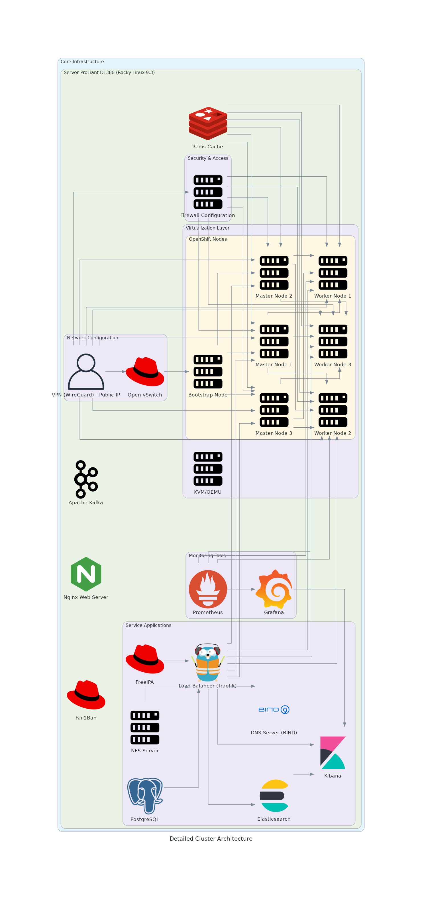

# Documento Detallado para la Implementación de Clúster OpenShift con KVM y Terraform

## Introducción

Este documento ofrece una guía detallada y exhaustiva para implementar un clúster OpenShift robusto y escalable utilizando KVM para la virtualización y Terraform para la automatización de la infraestructura. Este proceso incluye desde la configuración inicial del entorno hasta la configuración de monitoreo y automatización avanzada. Se abordarán aspectos técnicos fundamentales como la configuración de la red, estrategias de seguridad avanzadas, y el despliegue eficiente de aplicaciones, utilizando herramientas de automatización como Ansible y sistemas de monitoreo tales como Prometheus y Grafana.

## Paso 1: Configuración Inicial del Entorno

### Objetivo

El objetivo de esta fase es preparar el entorno que alojará el clúster, asegurando que todas las herramientas y dependencias necesarias estén correctamente instaladas y configuradas. Esto es esencial para garantizar la estabilidad y la escalabilidad del clúster.

- **KVM y libvirt**: Estas herramientas son fundamentales para la creación y gestión de las máquinas virtuales que constituirán el clúster. La configuración adecuada de KVM asegura una virtualización eficiente y segura, mientras que libvirt proporciona una capa de abstracción para interactuar con el hipervisor, facilitando la gestión de recursos virtuales.
- **Terraform y Ansible**: Terraform se utiliza para automatizar la provisión de la infraestructura, permitiendo un despliegue reproducible y modular del clúster. Ansible complementa esta automatización gestionando configuraciones y automatizando tareas post-despliegue, como la instalación de software y la configuración de servicios.
- **Open vSwitch**: Configurar Open vSwitch es crucial para implementar una red virtualizada dentro del clúster. Esto permite un manejo avanzado de la red, incluyendo segmentación, seguridad mejorada y optimización del tráfico entre las máquinas virtuales.

## Paso 2: Diseño e Infraestructura con Terraform

### Objetivo

Desarrollar y aplicar la infraestructura necesaria para el clúster, incluyendo redes, almacenamiento y máquinas virtuales. Esta fase es crítica para establecer las bases de un clúster eficiente y seguro.

- **Redes Virtuales**: La configuración de redes virtuales segmentadas es esencial para mejorar la seguridad y el aislamiento dentro del clúster. Terraform puede automatizar la creación de estas redes, asegurando una configuración consistente y sin errores humanos.
- **Almacenamiento**: Es fundamental definir soluciones de almacenamiento que gestionen eficientemente las imágenes de las máquinas virtuales y proporcionen opciones de almacenamiento persistente para datos críticos. Terraform ayuda en la creación y asignación de recursos de almacenamiento, mientras que las soluciones como NFS o SAN pueden ser integradas para satisfacer las necesidades de almacenamiento del clúster.

## Paso 3: Instalación y Configuración del Clúster OpenShift

### Objetivo

Instalar y configurar las VMs necesarias para el funcionamiento del clúster OpenShift. Cada componente del clúster juega un rol específico y debe ser configurado cuidadosamente para garantizar la funcionalidad y seguridad del clúster.

- **Bootstrap Node**: Este nodo (`bootstrap1`) es temporal y tiene como función inicializar el clúster. Con 1 CPU y 1024 MB de memoria, este nodo ejecuta procesos iniciales necesarios para la configuración de los nodos permanentes del clúster.
- **Master Nodes**: Los nodos maestros (`master1`, `master2`, `master3`) son cruciales para la gestión del clúster. Con 2 CPUs y 2048 MB de memoria cada uno, estos nodos coordinan todos los nodos del clúster y mantienen el estado del clúster mediante etcd, un sistema de almacenamiento distribuido clave-valor.
- **Worker Nodes**: Estos nodos (`worker1`, `worker2`, `worker3`) son los que realmente ejecutan las aplicaciones y manejan las cargas de trabajo del clúster. Equipados con 2 CPUs y 2048 MB de memoria cada uno, estos nodos son esenciales para el procesamiento de las solicitudes y el mantenimiento de las aplicaciones en ejecución.

## Paso 4: Configuración de Servicios Adicionales

### Objetivo

Implementar servicios adicionales que son esenciales para la operación y gestión del clúster. Estos servicios mejoran la seguridad, la gestión de identidades, y la capacidad de respuesta del clúster frente a diferentes cargas de trabajo.

- **FreeIPA**: La configuración de `freeipa1` con 1 CPU y 1024 MB de memoria facilita la gestión de identidades y políticas de seguridad dentro del clúster, permitiendo una administración centralizada de usuarios y autenticaciones.
- **Equilibrador de Carga**: El equilibrador de carga (`load_balancer1`), con 1 CPU y 1024 MB de memoria, es crucial para gestionar el tráfico entrante y distribuir las cargas de manera eficiente entre los nodos del clúster, utilizando HAProxy o Traefik.
- **NFS y PostgreSQL**: Los sistemas `nfs1` y `postgresql1`, ambos con 1 CPU y 1024 MB de memoria, son fundamentales para el almacenamiento persistente y la gestión de bases de datos dentro del clúster, asegurando que los datos importantes sean accesibles y seguros.

## Paso 5: Monitoreo y Alertas

### Objetivo

Configurar un sistema integral de monitoreo para mantener la salud y el rendimiento del clúster bajo vigilancia constante. Este sistema es vital para la operación continua y eficiente del clúster, permitiendo la detección temprana y la respuesta rápida a cualquier incidente.

- **Prometheus**: Integrar Prometheus para recopilar métricas del clúster es esencial para entender el estado y la salud del clúster en tiempo real. Prometheus permite una monitorización detallada y configurable, ideal para entornos dinámicos como OpenShift.
- **Grafana**: Utilizar Grafana para visualizar las métricas recogidas por Prometheus facilita la interpretación de los datos a través de paneles de control intuitivos y altamente configurables, permitiendo a los administradores tomar decisiones informadas rápidamente.
- **cAdvisor**: Implementar cAdvisor para el seguimiento del rendimiento y uso de recursos por parte de los contenedores ayuda a optimizar el despliegue de recursos y asegurar una gestión eficaz de los mismos dentro del clúster.

## Paso 6: Automatización con Ansible

### Objetivo

Utilizar Ansible para la automatización de configuraciones y manejo eficiente de las operaciones del clúster. Ansible es una herramienta poderosa que facilita la gestión de configuraciones complejas y la automatización de tareas repetitivas, mejorando la coherencia y reduciendo los errores humanos.

- **Playbooks de Ansible**: El desarrollo y ejecución de playbooks de Ansible permiten una gestión automatizada y optimizada del clúster, desde la configuración inicial hasta las actualizaciones regulares y el manejo de incidentes. Esto asegura que todas las acciones son ejecutadas de manera estandarizada y eficiente.

Este documento no solo guía la implementación técnica sino que también enfatiza la importancia de una gestión sistemática y una operación eficiente y segura del clúster OpenShift, proporcionando un entorno robusto y escalable para aplicaciones empresariales.

| Node Name         | CPUs | Memory (MB) |
|-------------------|------|-------------|
| bootstrap1        | 1    | 1024        |
| master1           | 2    | 2048        |
| master2           | 2    | 2048        |
| master3           | 2    | 2048        |
| worker1           | 2    | 2048        |
| worker2           | 2    | 2048        |
| worker3           | 2    | 2048        |
| freeipa1          | 1    | 1024        |
| load_balancer1    | 1    | 1024        |
| nfs1              | 1    | 1024        |
| postgresql1       | 1    | 1024        |
| bastion1          | 1    | 1024        |
| elasticsearch1    | 2    | 2048        |
| kibana1           | 1    | 1024        |

# Arquitectura de Red y Seguridad

## 1. Configuración de Red Virtualizada con Open vSwitch:
**Propósito:** Implementar una red virtualizada robusta que soporte las operaciones del clúster con eficiencia y seguridad.
**Implementación:** Utilizar Open vSwitch para gestionar la red virtual dentro del clúster. Esto incluye la configuración de segmentos de red y reglas para el tráfico entre máquinas virtuales, así como la integración con sistemas externos mediante enrutamiento dinámico o estático.

## 2. Automatización con Terraform:
**Objetivo:** Automatizar la creación y configuración de la infraestructura de red necesaria para el clúster.
**Especificaciones:** Utilizar Terraform para definir y desplegar configuraciones de red como parte del código de infraestructura, asegurando una replicación fácil y un manejo de configuración coherente.

## 3. Seguridad y Aislamiento de Red:
### VPN y Firewall:
- **VPN (Bastion1):** Configurar un servidor VPN usando Bastion con una IP pública asignada. Esto facilita un acceso seguro y controlado al clúster para administración y operaciones.
- **Firewall:** Establecer y mantener un sistema de firewall robusto que proteja contra accesos no autorizados y regule el tráfico hacia y desde el clúster.
- **FreeIPA (freeipa1):** Implementar FreeIPA para la gestión de identidades y políticas de seguridad dentro del clúster, ofreciendo un control centralizado sobre autenticaciones y accesos.

## 4. Almacenamiento y Gestión de Datos:
### Sistemas de Almacenamiento (NFS y PostgreSQL):
- **NFS (nfs1):** Proporcionar un sistema de almacenamiento de archivos para datos que requieren alta disponibilidad y acceso rápido.
- **PostgreSQL (postgresql1):** Gestionar bases de datos críticas para el clúster, proporcionando almacenamiento persistente y transaccional para aplicaciones y servicios del clúster.

## 5. Monitoreo y Alertas:
### Integración de Prometheus y Grafana:
- **Prometheus:** Configurar Prometheus para monitorear continuamente la salud y el rendimiento del clúster, recolectando métricas en tiempo real.
- **Grafana:** Usar Grafana para visualizar las métricas recogidas, facilitando análisis y toma de decisiones rápidas y fundadas.
- **cAdvisor:** Implementar cAdvisor para monitorear el uso de recursos y el rendimiento de los contenedores en el clúster, optimizando la gestión y despliegue de recursos.

## 6. Automatización de Operaciones con Ansible:
- **Playbooks de Ansible:** Desarrollar y ejecutar playbooks para automatizar la configuración y el mantenimiento del clúster, desde la instalación inicial hasta las actualizaciones y manejo de incidentes.

# Resumen de la Configuración del Clúster
**Nodos del Clúster:** Definir la configuración de hardware y software de los nodos Bootstrap, Master y Worker, cada uno con roles específicos y configuraciones optimizadas para soportar las demandas del clúster.
**Servicios Adicionales:** Detallar los servicios adicionales como balanceadores de carga y elasticsearch para mejorar la escalabilidad y la capacidad de respuesta del sistema.

Este enfoque estructurado asegura que todos los aspectos de la red y la seguridad están adecuadamente planificados y documentados, proporcionando una base sólida para la implementación exitosa del clúster OpenShift. Este documento debe servir como una guía clara para los equipos de infraestructura en la implementación y mantenimiento del clúster, asegurando que todos los componentes trabajen de manera cohesiva y segura.

# Clúster OpenShift

## Servidor: ProLiant DL380 G7 (Rocky Linux)

- **Open vSwitch**
  - Gestiona DHCP
  - Provee NAT

- **VPN (Bastion1)**
  - IP Pública Asignada

- **Firewall**
  - Protege VMs y servicios

- **Terraform**
  - Configura redes VMs
  - Provisión de recursos

- **Ansible**
  - Automatización
  - Configuración

- **Monitoreo y Gestión del Rendimiento**
  - **Prometheus**
    - Monitoreo de Métricas
  - **Grafana**
    - Visualización de Métricas
  - **cAdvisor**
    - Rendimiento de Contenedores

## Nodos OpenShift

- Bootstrap
- Master
- Worker

## Servicios Adicionales

- **FreeIPA (Gestión de Identidades)**
- **Load Balancer**

# Documento Detallado para la Implementación de Clúster OpenShift con KVM y Terraform

## Introducción

Este documento es una guía completa para implementar un clúster OpenShift robusto y escalable utilizando KVM para la virtualización y Terraform para la automatización de la infraestructura. Detallaremos la configuración de la red, las estrategias de seguridad avanzadas y el despliegue de aplicaciones, resaltando el uso de herramientas como Ansible y sistemas de monitoreo como Prometheus y Grafana.

## Configuración Inicial del Entorno

### Objetivos:

- Preparación del entorno: Asegurar la correcta instalación y configuración de todas las herramientas y dependencias.

### Herramientas clave:

- KVM y libvirt: Facilitan la creación y gestión de las VMs del clúster.
- Terraform y Ansible: Automatizan la creación de la infraestructura y las configuraciones post-despliegue.
- Open vSwitch: Implementa una red virtualizada dentro del clúster para optimizar el tráfico y la seguridad.

## Diseño e Infraestructura con Terraform

### Objetivos:

- Desarrollo de infraestructura: Configurar redes virtuales y soluciones de almacenamiento.

### Redes Virtuales:

- Utilizar Terraform para crear redes segmentadas que mejoren la seguridad.

### Almacenamiento:

- Integrar soluciones como NFS o SAN para el manejo eficiente de las imágenes de VMs y almacenamiento persistente.

## Instalación y Configuración del Clúster OpenShift

### Objetivos:

- Configuración de VMs: Detallar las especificaciones y roles de los nodos Bootstrap, Master y Worker para garantizar la seguridad y rendimiento del clúster.

## Configuración de Servicios Adicionales

### Objetivos:

- Seguridad y gestión de identidades: Implementar servicios clave como FreeIPA y un equilibrador de carga para mejorar la gestión del tráfico y las identidades.

## Monitoreo y Alertas

### Objetivos:

- Sistema de monitoreo: Configurar herramientas como Prometheus, Grafana y cAdvisor para monitorizar el clúster.

## Automatización con Ansible

### Objetivos:

- Automatización de tareas: Usar Ansible para gestionar configuraciones y automatizar operaciones mediante playbooks.

## Detalles Técnicos del Clúster

| Componente      | CPUs | Memoria (MB) | Descripción               |
|-----------------|------|--------------|---------------------------|
| Bootstrap Node  | 1    | 1024         | Inicializa el clúster     |
| Master Nodes    | 2    | 2048         | Gestión del clúster       |
| Worker Nodes    | 2    | 2048         | Ejecución de aplicaciones |
| FreeIPA         | 1    | 1024         | Gestión de identidades    |
| Load Balancer   | 1    | 1024         | Distribución de carga     |
| NFS             | 1    | 1024         | Almacenamiento de archivos|
| PostgreSQL      | 1    | 1024         | Gestión de bases de datos |
| Bastion Node    | 1    | 1024         | Acceso seguro al clúster  |
| Elasticsearch   | 2    | 2048         | Análisis de logs          |
| Kibana          | 1    | 1024         | Visualización de datos    |

| Característica   | Especificación                       |
|------------------|--------------------------------------|
| OS               | Rocky Linux 9.3 (Blue Onyx) x86_64   |
| Host             | ProLiant DL380 G7                    |
| Kernel           | 5.14.0-362.24.1.el9_3.0.1.x86_64     |
| Virtualization   | KVM                                  |
| Packages         | 1235 (rpm)                             |
| Shell            | bash 5.1.8                             |
| Resolution       | 1024x768                               |
| Terminal         | /dev/pts/0                             |
| CPU              | Intel Xeon X5650 (24) @ 2.666GHz       |
| GPU              | AMD ATI 01:03.0 ES1000                 |
| Memory           | 1093MiB / 35904MiB                     |
| Disk             | 1.5TB / 3.0TB                          |

## Resumen

Este documento detalla cada fase necesaria para configurar un clúster OpenShift, desde la preparación del entorno hasta la automatización avanzada y el monitoreo. La estructura propuesta asegura una implementación técnica precisa y una operación segura y eficiente, proporcionando un entorno robusto y escalable para aplicaciones empresariales.

# Documento Detallado para la Implementación de Clúster OpenShift con KVM y Terraform

## Introducción

Este documento proporciona una guía detallada para la implementación de un clúster OpenShift robusto y escalable usando KVM para la virtualización y Terraform para la automatización de la infraestructura. Abordaremos la configuración de la red, las estrategias de seguridad avanzadas, y el despliegue de aplicaciones, destacando el uso de herramientas como Ansible y sistemas de monitoreo como Prometheus y Grafana.

## Configuración Inicial del Entorno

### Objetivos

- **Preparación del entorno**: Asegurar que todas las herramientas y dependencias estén correctamente instaladas y configuradas.

### Herramientas clave

- **KVM y libvirt**: Crear y gestionar las VMs del clúster, proporcionando una virtualización eficiente.
- **Terraform y Ansible**: Automatizar la creación de la infraestructura y la configuración post-despliegue.
- **Open vSwitch**: Implementar una red virtualizada dentro del clúster para optimizar la gestión de tráfico y la seguridad.

## Diseño e Infraestructura con Terraform

### Objetivos

- **Desarrollo de infraestructura**: Configurar redes virtuales y soluciones de almacenamiento.
  - **Redes Virtuales**: Crear redes segmentadas con Terraform para mejorar la seguridad y el aislamiento.
  - **Almacenamiento**: Integrar soluciones como NFS o SAN para gestionar las imágenes de las VMs y proporcionar almacenamiento persistente.

## Instalación y Configuración del Clúster OpenShift

### Objetivos

- **Configuración de VMs**: Instalar y configurar las VMs para el clúster.
  - **Nodos Bootstrap, Master, y Worker**: Establecer las especificaciones y roles de cada nodo para garantizar el rendimiento y la seguridad del clúster.

## Configuración de Servicios Adicionales

### Objetivos

- **Mejora de la seguridad y gestión de identidades**: Implementar servicios clave para la operación del clúster.
  - **FreeIPA y Equilibrador de Carga**: Facilitar la gestión de identidades y el tráfico entrante.
  - **NFS y PostgreSQL**: Proporcionar sistemas de almacenamiento y gestión de bases de datos.

## Monitoreo y Alertas

### Objetivos

- **Implementación de un sistema de monitoreo**: Configurar Prometheus, Grafana, y cAdvisor para monitorizar el clúster.
  - **Prometheus y Grafana**: Recopilar y visualizar métricas en tiempo real.
  - **cAdvisor**: Monitorear el rendimiento y uso de recursos por parte de los contenedores.

## Automatización con Ansible

### Objetivos

- **Automatización de tareas**: Utilizar Ansible para gestionar configuraciones y automatizar operaciones.
  - **Playbooks de Ansible**: Desarrollar y ejecutar playbooks para una gestión eficiente del clúster.

## Detalles Técnicos del Clúster

| Componente       | CPUs | Memoria (MB) | Descripción                |
|------------------|------|--------------|----------------------------|
| Bootstrap Node   | 1    | 1024         | Inicializa el clúster      |
| Master Nodes     | 2    | 2048         | Gestión del clúster        |
| Worker Nodes     | 2    | 2048         | Ejecución de aplicaciones  |
| FreeIPA          | 1    | 1024         | Gestión de identidades     |
| Load Balancer    | 1    | 1024         | Distribución de carga      |
| NFS              | 1    | 1024         | Almacenamiento de archivos |
| PostgreSQL       | 1    | 1024         | Gestión de bases de datos  |
| Bastion Node     | 1    | 1024         | Acceso seguro al clúster   |
| Elasticsearch    | 2    | 2048         | Análisis de logs           |
| Kibana           | 1    | 1024         | Visualización de datos     |

### Especificaciones del Servidor Físico

| Característica   | Especificación                       |
|------------------|--------------------------------------|
| OS               | Rocky Linux 9.3 (Blue Onyx) x86_64   |
| Host             | ProLiant DL380 G7                    |
| Kernel           | 5.14.0-362.24.1.el9_3.0.1.x86_64     |
| Virtualization   | KVM                                  |
| Packages         | 1235 (rpm)                             |
| Shell            | bash 5.1.8                             |
| Resolution       | 1024x768                               |
| Terminal         | /dev/pts/0                             |
| CPU              | Intel Xeon X5650 (24) @ 2.666GHz       |
| GPU              | AMD ATI 01:03.0 ES1000                 |
| Memory           | 1093MiB / 35904MiB                     |
| Disk             | 1.5TB / 3.0TB                          |

# Server Configuration Summary

## Server Specifications
- **OS:** Rocky Linux 9.3 (Blue Onyx)
- **Host:** ProLiant DL380 G7
- **Kernel:** 5.14.0-362.24.1.el9_3.0.1.x86_64
- **CPU:** Intel Xeon X5650 (24 cores) @ 2.666GHz
- **GPU:** AMD ATI 01:03.0 ES1000
- **Memory:** 1093MiB / 35904MiB
- **Resolution:** 1024x768
- **Shell:** bash 5.1.8
- **Packages:** 1235 (rpm)
- **Terminal:** /dev/pts/0

## Network Interfaces
| Interface | IP Address     | Netmask         | Broadcast       |
|-----------|----------------|-----------------|-----------------|
| enp3s0f0  | 192.168.0.24   | 255.255.255.0   | 192.168.0.255   |
| enp3s0f1  | 192.168.0.25   | 255.255.255.0   | 192.168.0.255   |
| enp4s0f0  | 192.168.0.20   | 255.255.255.0   | 192.168.0.255   |
| enp4s0f1  | 192.168.0.26   | 255.255.255.0   | 192.168.0.255   |
| lo        | 127.0.0.1      | 255.0.0.0       | N/A             |

## Disk Configuration
- **/dev/sda:** 3.27 TiB
- **/dev/sdb:** 465.71 GiB
- **Logical Volume Management:**
  - **Root:** 100 GiB
  - **Swap:** 17.72 GiB
  - **Home:** 3 TiB

## Disk Partitions
| Device   | Start      | End        | Size       | Type           |
|----------|------------|------------|------------|----------------|
| /dev/sda1| 2048       | 4095       | 2048       | System         |
| /dev/sda2| 4096       | 2101247    | 2 GB       | Linux Filesystem|
| /dev/sda3| 2101248    | 6204170239 | ~2.89 TiB  | Linux Filesystem|

## Memory and Storage
- **Total Memory:** 35GiB
- **Free Memory:** 33GiB
- **Swap:** 17GiB

## Filesystem Usage
| Filesystem        | Size   | Used   | Available | Use% | Mounted on |
|-------------------|--------|--------|-----------|------|------------|
| /dev/mapper/rl-root| 100G   | 7.5G   | 93G       | 8%   | /          |
| /dev/sda2         | 1014M  | 718M   | 297M      | 71%  | /boot      |
| /dev/mapper/rl-home| 3.0T   | 25G    | ~3.0T     | 1%   | /home      |

This configuration provides a detailed view of the system setup, ensuring all elements are concisely documented for effective cluster management.

# Configuración de Máquinas Virtuales en CEFAS Local Server
## Red NAT con IPs Fijas y Nombres de Dominio Asignados

| Máquina          | CPU (cores) | Memoria (MB) | IP          | Dominio                               |
|------------------|-------------|--------------|-------------|---------------------------------------|
| **Bootstrap1**   | 1           | 1024         | 10.17.3.10  | bootstrap.cefaslocalserver.com       |
| **Master1**      | 2           | 2048         | 10.17.3.11  | master1.cefaslocalserver.com         |
| **Master2**      | 2           | 2048         | 10.17.3.12  | master2.cefaslocalserver.com         |
| **Master3**      | 2           | 2048         | 10.17.3.13  | master3.cefaslocalserver.com         |
| **Worker1**      | 2           | 2048         | 10.17.3.14  | worker1.cefaslocalserver.com         |
| **Worker2**      | 2           | 2048         | 10.17.3.15  | worker2.cefaslocalserver.com         |
| **Worker3**      | 2           | 2048         | 10.17.3.16  | worker3.cefaslocalserver.com         |
| **FreeIPA1**     | 1           | 1024         | 10.17.3.17  | dns.cefaslocalserver.com             |
| **Load Balancer1** | 1        | 1024         | 10.17.3.18  | loadbalancer.cefaslocalserver.com    |
| **NFS1**         | 1           | 1024         | 10.17.3.19  | nfs.cefaslocalserver.com             |
| **PostgreSQL1**  | 1           | 1024         | 10.17.3.20  | postgresql.cefaslocalserver.com      |
| **Bastion1**     | 1           | 1024         | 10.17.3.21  | bastion.cefaslocalserver.com         |
| **Elasticsearch1** | 2        | 2048         | 10.17.3.22  | elasticsearch.cefaslocalserver.com   |
| **Kibana1**      | 1           | 1024         | 10.17.3.23  | kibana.cefaslocalserver.com          |

Este documento presenta la configuración técnica de cada máquina virtual establecida bajo el dominio `cefaslocalserver.com`, proporcionando detalles sobre los recursos de hardware asignados y las direcciones IP fijas dentro de una red NAT.
